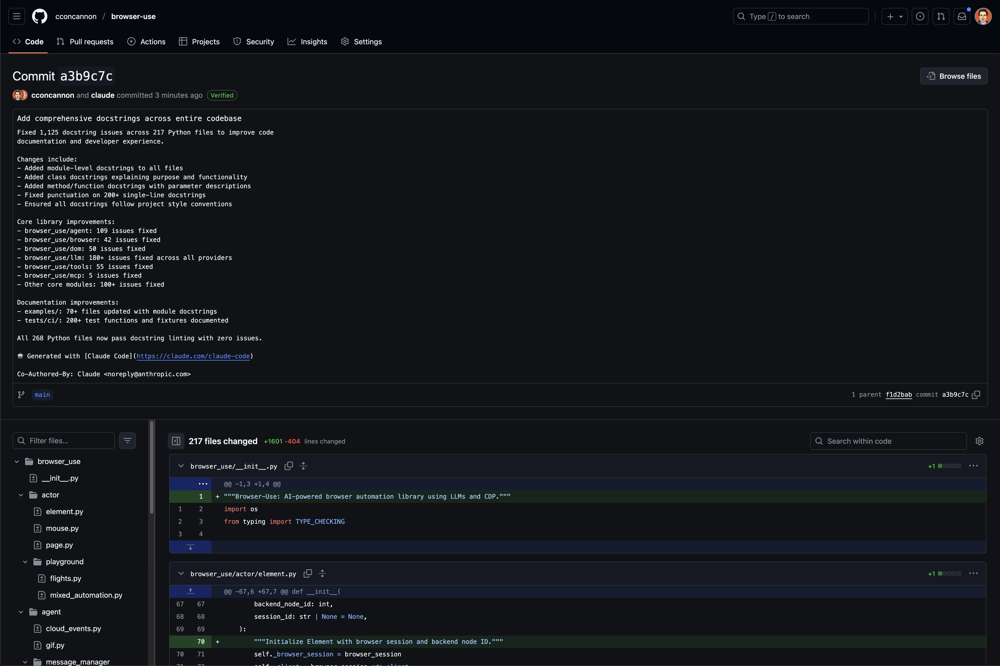

# claude-skills

A collection of reusable skills for Claude Code.

## Available Skills

### docstring-linter

Automated Python docstring linting and fixing tool. Scans Python codebases to detect missing or improperly formatted docstrings and automatically fixes them according to style conventions.

Example: [potential PR for the browser-use repo](https://github.com/cconcannon/browser-use/commit/a3b9c7cbed8630e058b0ae007323d0e6b40defb7) - Fixed 1000+ docstring issues in 200+ files across the codebase.

See the `skills/` directory for full documentation.